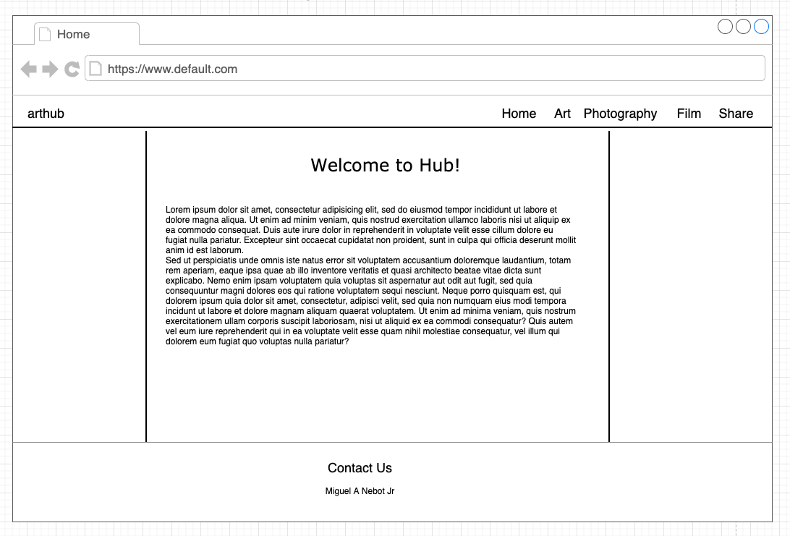
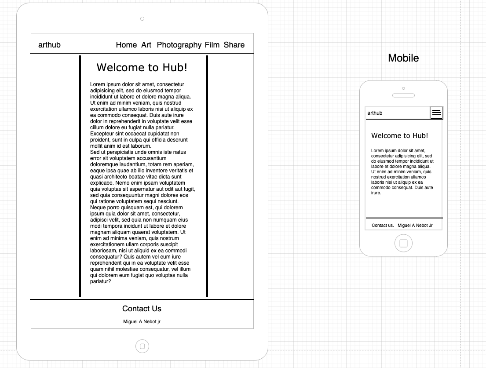
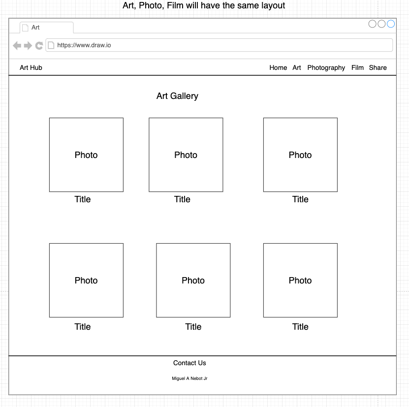
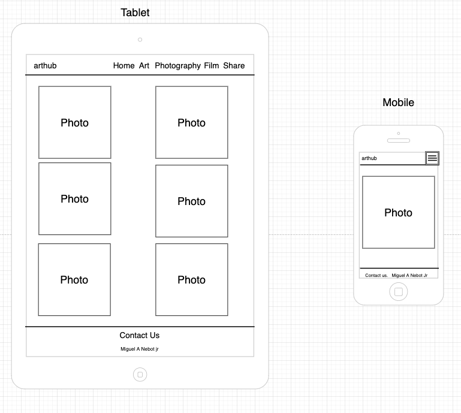
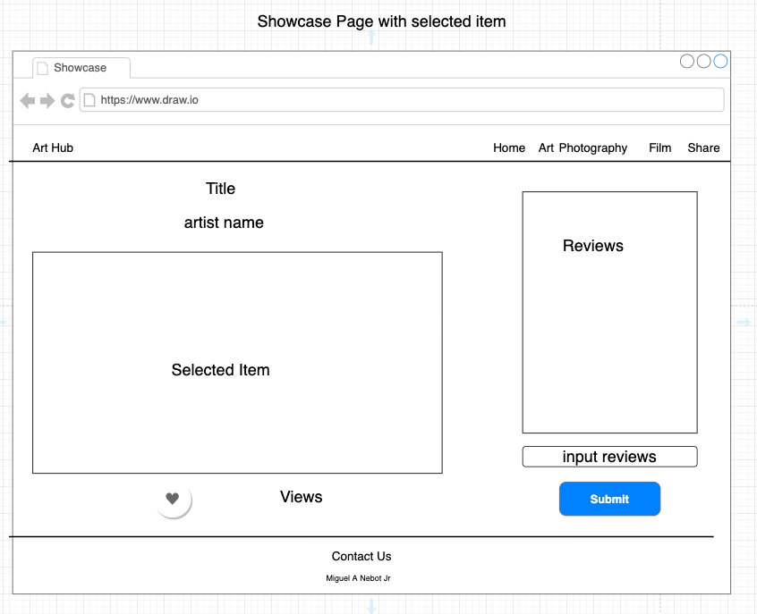
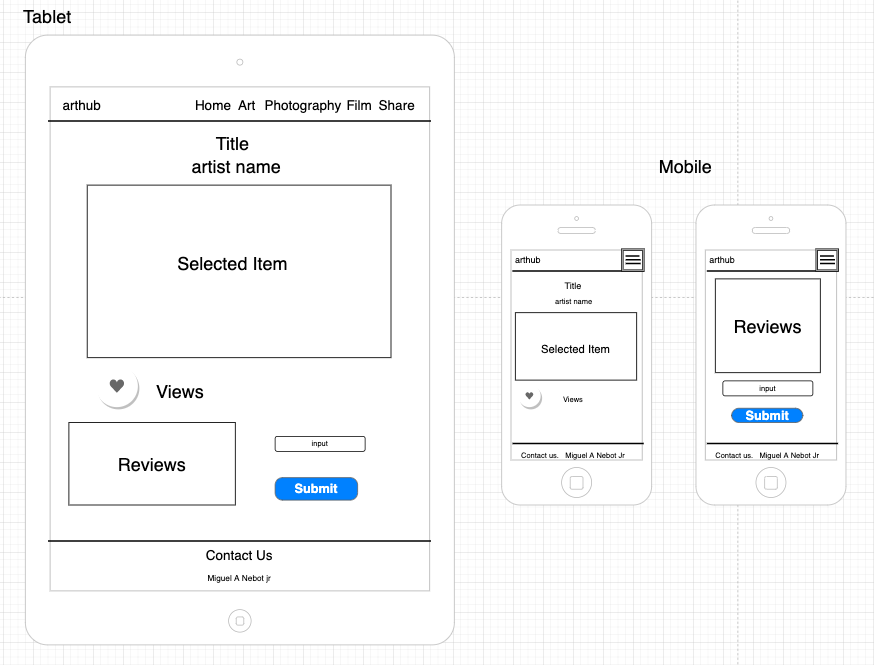
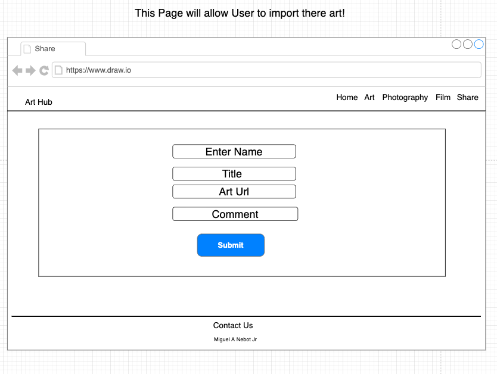
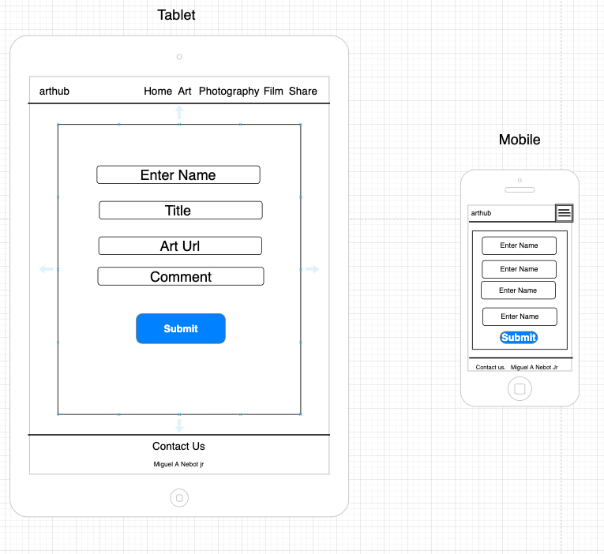

# arthub

(link for netifly.app)

## Project Description

Arthub is created using Airtable and React. This site targets artists from all around to share, like, review art work. The landing page will have a description about the intention of this site. The user will have access to links that will take them to either art, photo, or video page. These items will be displayed with an image and a title. Once an item is clicked. The user will be directed to a showcase page. On the showcase page, the item's image will be displayed larger. With the image, there be a title, author, how many views, likes, and comment text area. Comments can be posted and deleted. Back on the homepage there will be a link to share new art. With the fields for title, author, and url for images. 

## Wireframes

The wireframes below depict the homepage and review feed for arthub in web, tablet and phone format. The homepage contains a header displaying the app title, a navigation bar with 4 links - art, photos, videos, share - that route to each respective pages. The share page will contain an input form and submit button for adding new art data. On the showcase there will be a like button. Next to it will be a icon of how many view. At the bottom at comment box to submit or delete post. The screens will center as screen size decreases.











## Component Hierarchy


## API and Data Sample

https://api.airtable.com/v0/appLn1WPRGXST4Sg5/art/recaedo1NVH5VEw0r 

Airtable is returning the data for this base as follows:

```
{
    "id": "recaedo1NVH5VEw0r",
    "fields": {
        "image": "https://images-wixmp-ed30a86b8c4ca887773594c2.wixmp.com/i/9757d496-239b-46c5-baea-6873cbfe9b3d/dekl5mu-15660945-64af-4ca3-beaf-4ff85af67068.jpg",
        "artist": "JoeyJazz",
        "title": "NeonCity",
        "views": 10,
        "likes": 5,
        "reviews": [
            "Love this spacey feel",
            "colors are amazing!!!"
        ]
    },
    "createdTime": "2021-06-28T23:54:44.000Z"
}

```

### MVP/PostMVP

#### MVP

- Home page with clickable links that route to each respective pages.
- Get and post of art from Airtable.
- Use forms to create new art entries and update Airtable.
-

#### PostMVP

- Improve the css to make the site more fun and attractive.
- Give user subscription with personal bios.
- Add a comment box on showcase cards.
- Add delete button for each art post.

## Project Schedule

| Day      | Deliverable                                | Status     |
| -------- | ------------------------------------------ | ---------- |
| Jun 29   | Proposal Approval / Airtable Setup         | Incomplete |
| Jun 30   | Component Creation / Get, Set, Delete Data | Incomplete |
| Jul 01   | Oct. 12 cont'd / CSS Components            | Incomplete |
| Jul 02   | CSS Components cont'd / MVP / Deploy       | Incomplete |
| Jul 03   | Advanced CSS                               | Incomplete |
| Jul 07   | Presentations                              | Incomplete |

## Timeframes

| Component                 | Priority | Estimated Time | Time Invested | Actual Time |
| ------------------------- | :------: | :------------: | :-----------: | :---------: |
| Proposal                  |    H     |      2hrs      |     0hrs      |    0hrs     |
| Airtable setup            |    H     |     .5hrs      |      0hr      |     0hr     |
| links / Routes            |    H     |      1hrs      |      0hr      |     0hr     |
| Data population art       |    H     |      3hrs      |     0hrs      |    0hrs     |
| Data population photo     |    H     |      3hrs      |     0hrs      |    0hrs     |
| Data population film      |    H     |      3hrs      |     0hrs      |    0hrs     |
| Showcase creation art     |    H     |      2hrs      |     0hrs      |    0hrs     |
| Showcase creation photo   |    H     |      2hrs      |     0 hr      |     0hr     |
| Showcase creation film    |    H     |      2hrs      |     0 hr      |     0hr     |
| Form creation/art         |    H     |      3hrs      |     0hrs      |    0hrs     |
| Form creation/photo       |    H     |      3hrs      |      0hr      |     0hr     |
| Form creation/film        |    H     |      3hrs      |      0hr      |     0hr     |
| Data deletion art         |    H     |      2hrs      |      0hr      |     0hr     |
| Data deletion photo       |    H     |      2hrs      |      0hr      |     0hr     |
| Data deletion film        |    H     |      2hrs      |      0hr      |     0hr     |
| Component CSS art         |    H     |      3hrs      |     0hrs      |    0hrs     |
| Component CSS photo       |    H     |      3hrs      |     0hrs      |    0hrs     |
| Component CSS film        |    H     |      3hrs      |     0hrs      |    0hrs     |
| Total                     |    H     |    42.5hrs     |     0 hrs     |     0hrs    |

## SWOT Analysis

### Strengths:

After doing project 1, I have a better understanding of the steps I need to take to deploy this new project. I feel like I have the ability to over come issue I had with the first project. I'm more comfortable with axios calls now vs project 1. I also grew in css. 

### Weaknesses:

I don't feel like, I have fully understanding of class components methods. I'll probably stick to functional components. Makes more sense to me. 

### Opportunities:

Unit 2 focused on using react. I'm excited to put it to use. These last 2 weeks I learned many things that could have fixed some of the issue I had during p1. 

### Threats:

I'm planing on using 3 tables in AirTable. I might be bitting more then I can chew. I'm not sure how well AirTable will handle the video url. Posting to 3 different tables might be difficult.  
